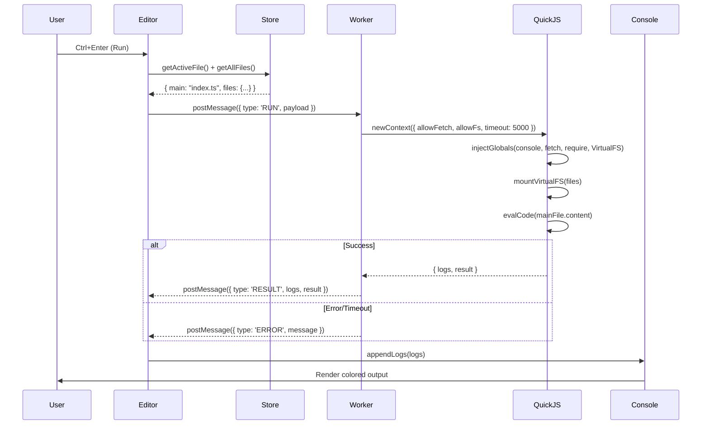

# Architecture Overview

## System Context

```
┌─────────────────────────────────────────────────────────────────────────────┐
│                           JS RUNNER ARCHITECTURE                              │
│                         (Client-Side Only - Vercel)                           │
└─────────────────────────────────────────────────────────────────────────────┘
```

## High-Level Architecture

```
┌─────────────────────────────────────────────────────────────────────────────┐
│                            MAIN THREAD (UI)                                   │
│  ┌─────────────────┐  ┌─────────────────┐  ┌─────────────────────────────┐  │
│  │   File Tree     │  │  Monaco Editor  │  │      Console Output         │  │
│  │   + Tabs        │  │  (TS/JS/JSON)   │  │  (logs, errors, network)    │  │
│  └────────┬────────┘  └────────┬────────┘  └───────────────┬─────────────┘  │
│           │                    │                         │                   │
│           └────────────────────┼─────────────────────────┘                   │
│                                ▼                                               │
│                   ┌────────────────────────┐                                  │
│                   │   Execution Controller  │  (Zustand Store)                │
│                   │  - Spawns Worker       │                                  │
│                   │  - 5s CPU timeout      │                                  │
│                   │  - Aggregates logs     │                                  │
│                   └─────────────┬──────────┘                                  │
│                                 │ postMessage                                  │
└─────────────────────────────────┼──────────────────────────────────────────────┘
                                  ▼
┌─────────────────────────────────────────────────────────────────────────────┐
│                          WEB WORKER (Isolated)                                │
│  ┌─────────────────────────────────────────────────────────────────────┐    │
│  │                      QuickJS WASM Runtime                            │    │
│  │  • evalCode() with real CPU timeout (5s)                            │    │
│  │  • allowFetch: true  → native fetch functional                      │    │
│  │  • allowFs: true     → Virtual FS for multi-file imports            │    │
│  │  • Memory limit: 50MB                                                │    │
│  │                                                                       │    │
│  │  Injected Globals:                                                   │    │
│  │  • console.log/error/warn/table/time → postMessage to main          │    │
│  │  • fetch() → intercepts, logs request/response                      │    │
│  │  • import.meta.resolve → resolves via import map                    │    │
│  │  • __filename, __dirname, require, module, exports                  │    │
│  └─────────────────────────────────────────────────────────────────────┘    │
└─────────────────────────────────────────────────────────────────────────────┘
```

## Technology Stack

| Layer | Technology | Version | Purpose |
|-------|------------|---------|---------|
| **Framework** | Next.js | 15.x (App Router) | Static export, React 19 |
| **Editor** | @monaco-editor/react | 4.x | VS Code editor in browser |
| **TypeScript** | monaco-editor-core | 0.51.x | TS language service (worker) |
| **Execution** | @jitl/quickjs-ng-wasmfile-release-sync | 0.25.x | Secure JS/TS sandbox |
| **Worker** | quickjs-emscripten-core | 0.25.x | WASM runtime binding |
| **State** | Zustand | 4.x | Lightweight state management |
| **Persistence** | idb | 8.x | IndexedDB wrapper |
| **Styling** | Tailwind CSS | 4.x | Utility-first CSS |
| **UI Components** | shadcn/ui | latest | Accessible components |
| **Icons** | lucide-react | 0.4.x | SVG icons |
| **Auto-typings** | monaco-editor-auto-typings | 2.x | Auto-load @types from esm.sh |

## Data Flow

### Run Code Flow



### File Management Flow

```
User Action          Store Action              Persistence
─────────────────────────────────────────────────────────────
Create file    →    addFile()            →    debounced save (500ms)
Edit file      →    updateFile()        →    debounced save (500ms)
Delete file    →    deleteFile()        →    immediate save
Switch tab     →    setActiveFile()     →    save cursor position
Add package    →    addImportMapEntry() →    immediate save
```

## Component Architecture

```
app/
├── layout.tsx                    # Root providers, import map, fonts
├── page.tsx                      # Main IDE (client component)
├── globals.css                   # Tailwind 4 + CSS variables + grid
└── components/
    ├── Editor/
    │   ├── Editor.tsx            # Monaco wrapper (dynamic import)
    │   ├── FileTabs.tsx          # Tab bar with dirty indicators
    │   ├── FileTree.tsx          # Collapsible sidebar explorer
    │   ├── MonacoProvider.tsx    # Worker config, TS options
    │   ├── useMonacoModels.ts    # Multi-file model management
    │   └── useAutoTypings.ts     # Auto-load @types from esm.sh
    ├── Console/
    │   ├── ConsoleOutput.tsx     # Virtualized log list
    │   ├── ConsoleToolbar.tsx    # Filters, clear, copy, download
    │   └── useConsole.ts         # Log aggregation hook
    ├── Layout/
    │   ├── AppShell.tsx          # CSS Grid layout
    │   ├── Header.tsx            # Run button, zoom, sidebar toggle
    │   ├── ResizableSplit.tsx    # Editor/console splitter
    │   └── CollapsibleSidebar.tsx # File tree toggle
    └── UI/                       # shadcn components
```

## Security Model

```
┌─────────────────────────────────────────────────────────────────┐
│                      SECURITY BOUNDARIES                         │
├─────────────────────────────────────────────────────────────────┤
│                                                                  │
│  MAIN THREAD (Trusted)                                          │
│  ├─ Full DOM access                                             │
│  ├─ localStorage/IndexedDB access                               │
│  ├─ Network fetch (for packages)                                │
│  └─ User interaction                                            │
│                                                                  │
│  ──────── postMessage (structured clone) ────────               │
│                                                                  │
│  WEB WORKER (Untrusted - User Code)                             │
│  ├─ NO DOM access                                               │
│  ├─ NO localStorage/IndexedDB                                   │
│  ├─ NO direct network (except via injected fetch)              │
│  ├─ CPU time limited (5s)                                       │
│  ├─ Memory limited (50MB)                                       │
│  └─ QuickJS WASM sandbox                                        │
│                                                                  │
│  ──────── QuickJS Internal ────────                            │
│                                                                  │
│  QUICKJS CONTEXT (Heavily Restricted)                           │
│  ├─ No eval/Function constructor                                │
│  ├─ No WebAssembly.compile                                      │
│  ├─ No access to host globals                                   │
│  ├─ Only injected: console, fetch, require, VirtualFS          │
│  └─ Module resolution via import map only                       │
│                                                                  │
└─────────────────────────────────────────────────────────────────┘
```

## Performance Strategy

| Concern | Solution |
|---------|----------|
| **Initial Load** | Dynamic import for Monaco (`ssr: false`), lazy load TS worker |
| **Monaco Bundle** | ~3MB base, ~10MB TS worker (loaded on first `.ts` file) |
| **QuickJS WASM** | ~2MB, preloaded in background after hydration |
| **Type Definitions** | Cached in localStorage via `monaco-editor-auto-typings` |
| **Large Files** | Monaco virtualized rendering, console virtualized list |
| **Auto-save** | Debounced 500ms, batched IndexedDB writes |
| **Zoom** | CSS `transform: scale()` - no re-layout |

## Scalability Limits (Client-Side)

| Resource | Limit | Reason |
|----------|-------|--------|
| Files per workspace | ~1000 | IndexedDB practical limit |
| File size | ~5MB each | Monaco performance |
| Console history | 1000 entries | Memory management |
| Execution timeout | 5 seconds | CPU quota |
| Memory per execution | 50MB | WASM memory limit |
| NPM packages | Unlimited (CDN) | esm.sh handles caching |

## Failure Modes & Handling

| Failure | Detection | Recovery |
|---------|-----------|----------|
| Worker crash | `onerror` / timeout | Restart worker, show error |
| WASM load fail | `fetch` error | Fallback to `new Function()` (limited) |
| Monaco worker fail | Console warning | Fallback to main thread (slower) |
| IndexedDB quota | `QuotaExceededError` | Prompt user to clear old workspaces |
| Network (packages) | `fetch` error | Show error, allow offline editing |
| Type definitions | 404 from esm.sh | Continue without types |